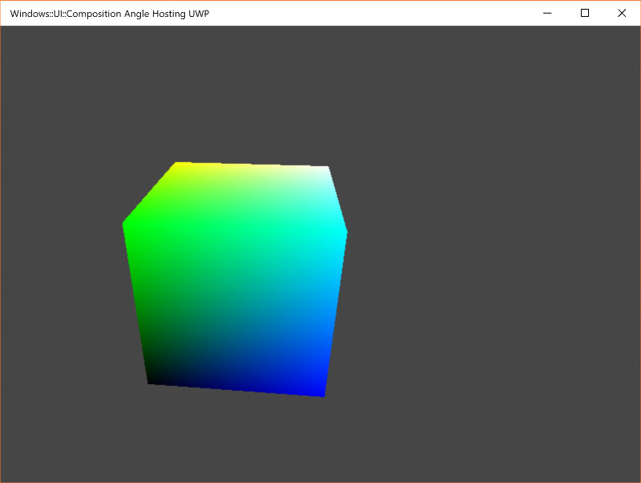

# AngleHosting Test
This project demonstrates how to use Angle, a library for adapting OpenGL to DirectX graphics calls, across a number of different Windows project types.

Before you can build / run this project, you will need Angle binaries! As of right now, you’ll need to build Angle yourself (don’t worry, it’s easy, you just need to run a single script and wait a bit).

If you just want to grab pre-compiled binaries..  let me know, I’ll publish some :-)  In the meantime, you’ll need to build your own.

#### Building my fork of Angle from source
1) Make sure you have VS2019 installed including
* Debugging tools for Windows, 
* Desktop developmenet with c++
* the C++/WinRT extension
* the Windows 10 Standalone SDK version 10.0.17134
2) Follow the instructions [here](https://commondatastorage.googleapis.com/chrome-infra-docs/flat/depot_tools/docs/html/depot_tools_tutorial.html#_setting_up) to install Depot Tools
3) Assuming you have cloned this repo, start a command prompt in the root
4) Switch to scripts dir ```cd scripts```
5) Run the uber-script to fetch and build Angle ```getandbuild.bat```

If you get this as I did on one machine..
```
[56/4305] COPY "C:/Program Files (x86)/Windows Kits/10/Redist/D3D/x64/d3dcompiler_47.dll" d3dcompiler_47.dll
FAILED: d3dcompiler_47.dll
C:/Users/james/Tools/depot_tools/bootstrap-3_8_0_chromium_8_bin/python/bin/python.exe ../../build/toolchain/win/tool_wrapper.py recursive-mirror "C:/Program Files (x86)/Windows Kits/10/Redist/D3D/x64/d3dcompiler_47.dll" d3dcompiler_47.dllTraceback (most recent call last):
  File "../../build/toolchain/win/tool_wrapper.py", line 51, in <module>
    import win32file    # pylint: disable=import-error
ImportError: No module named win32file
```

.. do this ```python -m pip install pywin32```

.. and you should be good.

If all of the above machinery succeeded, you should see a folder call dependencies with heads, libs and binaries for Angle.  If so, go ahead and open the main AngleHosting solution and you should be able to build and run either the Win32 or UWP version.

Make sure you switch to x64 debug.  Still todo to make this build in other configurations. 	


