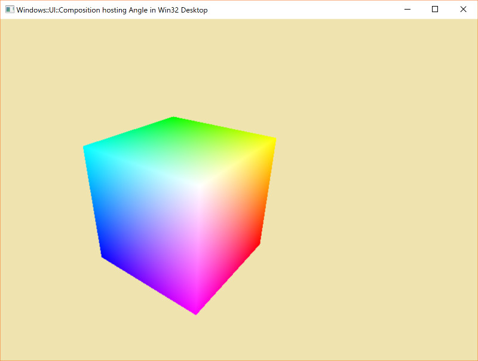

# AngleHosting Test
This project leverages my fork of Angle which can be found here:

https://github.com/clarkezone/angle/commits/winuicomp

 In the above branch cloned from the Microsoft fork of Angle, I have added support for hosting Angle rendered content in the Windows visual tree using a SpriteVisual object from the Windows::UI::Composition namespace as a hosting element backed by a SwapChain object that Angle renders into.

 In this project which requires an Angle binary built from the above, I've experimented with building a universal library that calls Angle for rendering, leverages the SpriteVisual hosting mechanism and hooks it up from both a Universal Windows Platform host as well as from a Desktop Win32 host.
 
 The former is a classic frameworkless / CoreWindow style of UWP; It could just as easily be a XAML host using UIElement / SpriteVisual interop.

 For the latter, I've used two relatively new constructs:

 1) [```DesktopCompositionTarget```](https://docs.microsoft.com/en-us/uwp/api/windows.ui.composition.desktop.desktopwindowtarget) which enables a WUC visual tree to be bound to a plain old HWND

 2) [```DispatcherQueue```](https://docs.microsoft.com/en-us/uwp/api/windows.system.dispatcherqueue) which provides a Win32 desktop friendly messagepump to fully enable the WUC compositor in a desktop context

 Aditionally, by using smartpointer wrappers generated by the latest C++/WinRT tooling and available in the latest Windows SDK builds it's very easy to construct and manipulate the objects in a standard way from either context.


